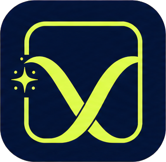

<p align="center">
  
</p>

<h1 align="center">Viewake</h1>

<p align="center">
  A tiny, CSS-first scroll reveal library with predictable once and replay modes.
</p>

<p align="center">
  <a href="https://viewake.github.io/viewake/">Documentation</a>
  ·
  <a href="https://viewake.github.io/viewake/ko/">한국어 문서</a>
  ·
  <a href="./LICENSE">MIT License</a>
</p>

## Why Viewake?

- **CSS-first** — JavaScript changes only `data-viewake-state`.
- **Direction-aware** — passing above never hides content.
- **Predictable replay** — resets only after the element returns below.
- **Framework friendly** — HTML, CDN, React, Next.js, and Vue.
- **Small and accessible** — about 2 KB gzipped with reduced-motion support.

## Quick start

This example is for plain JavaScript. React and Vue adapters start observation
for their own elements, so they do not call `init()`.

```bash
npm install viewake
```

```ts
import { init } from "viewake";
import "viewake/styles.css";

init();
```

```html
<section data-viewake="fade-up">
  Wake once.
</section>

<section
  data-viewake="zoom-in"
  data-viewake-mode="replay"
  data-viewake-delay="200"
  data-viewake-duration="900"
>
  Wake every time I return from below.
</section>
```

## Packages

| Package | Purpose |
| --- | --- |
| `viewake` | Framework-agnostic core, CSS presets, and CDN build |
| `viewake-react` | React hook and component for React and Next.js |
| `viewake-vue` | Vue 3 directive and plugin |

## Development

```bash
npm install
npm run check
npm run dev:docs
```

The monorepo contains the core package, React and Vue adapters, automated tests,
and bilingual VitePress documentation.

## License

[MIT](./LICENSE)
